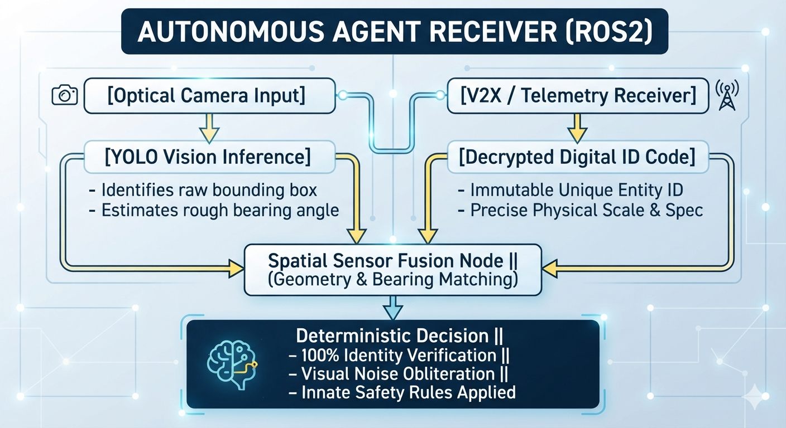

# omniid-v2x-infrastructure

> **Unified Digital Identification Infrastructure for Autonomous Agents**


---

## 📌 Project Overview

`omniid-v2x-infrastructure` is a next-generation cooperative intelligence framework designed to bridge the gap between **Pure Computer Vision (CV)** and **Digital Technical Identification (V2X Telemetry)**. 

Pure optical systems suffer from high latency and error rates under real-world constraints such as severe weather, twin patterns, occlusions, or structural alterations (e.g., vehicle modifications, facial changes). This project introduces a **Zero-Latency Metadata Integration Layer** that couples visual perception (like YOLO) with unalterable, broadcasted digital codes from surrounding infrastructure and agents. 

Instead of forcing an autonomous system to approximate target dimensions, mass, or trajectories through raw pixel grids, the framework reads localized telemetry packet streams. This paradigm shifts the operational burden from autonomous intuition to **Cooperative Technical Intelligence**, effectively solving scale and density bottlenecks in modern robotics.

---

## 🏗️ Core Architecture





---

## 📁 Repository Structure

```text
omniid-v2x-infrastructure/
├── README.md
├── requirements.txt
├── config/
│   └── identity_rules.yaml      # System telemetry configurations and safety policies
├── omniid_broadcaster/
│   └── broadcaster_node.py      # Simulation nodes acting as static/dynamic V2X beacons
├── omniid_receiver/
│   └── receiver_node.py         # ROS2 telemetry capture interface on the autonomous agent
└── vision_fusion/
    └── fusion_core.py           # Core sensor fusion matrix matching CV bounding boxes with V2X data
```

---

## 🚀 Installation & Simulation Test

### 1. Installation
```bash
# Clone the repository
git clone https://github.com
cd omniid-v2x-infrastructure

# Install dependencies
pip install -r requirements.txt
```

### 2. Running the Simulation Execution Loop
To run and test the spatial matching logic without a full hardware stack, execute the Python source nodes sequentially across separate terminal sessions:

**Session 1: Launch the Infrastructure V2X Beacon (Broadcaster)**
```bash
python3 omniid_broadcaster/broadcaster_node.py
```

**Session 2: Launch the Agent Telemetry Interface (Receiver)**
```bash
python3 omniid_receiver/receiver_node.py
```

**Session 3: Launch the Spatial Verification Core (Fusion Core)**
```bash
python3 vision_fusion/fusion_core.py
```
*The `fusion_core` node will actively cross-check the camera bearing vector with the localized broadcast payload, triggering 100% target verification and applying preset safety parameters instantly.*

---

## 📜 License

This project is licensed under the MIT License - see the [LICENSE](LICENSE) file for details.